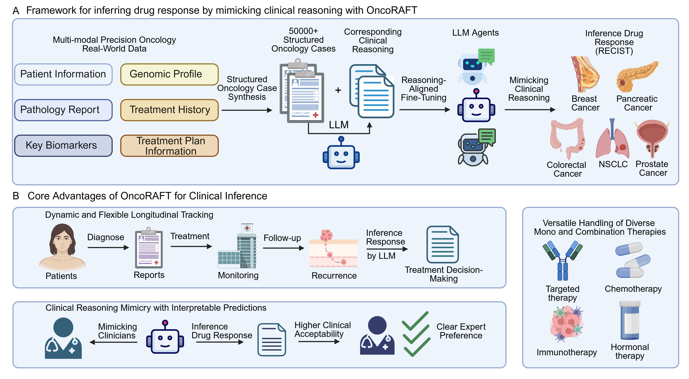

# **OncoRAFT: Reasoning-Aligned Fine-Tuning for Cancer Drug Response Prediction**

## OncoRAFT: A Framework for Inferring Drug Response



## **Overview**

**OncoRAFT** is a Large Language Model (LLM) framework designed to predict patient-specific cancer drug response by mimicking clinical reasoning processes. This repository implements the **Reasoning-Aligned Fine-Tuning (RAFT)** methodology, which trains LLMs to infer short-term real-world drug response while providing interpretable clinical rationales.

### **Key Features**

* 🎯 **Clinical Reasoning Alignment**: Dual-objective training that optimizes both predictive accuracy and clinical rationale generation
* 📊 **Multi-Modal Data Integration**: Processes diverse clinical data including pathology reports, genomic profiles, and treatment histories
* 🔄 **Longitudinal Tracking**: Dynamically tracks patient clinical journey over time
* 💊 **Versatile Therapy Handling**: Supports single-agent and combination therapies (targeted therapy, chemotherapy, immunotherapy, hormonal therapy)
* 🔍 **Interpretable Predictions**: Generates human-readable rationales for each prediction
* 🏥 **Clinically Validated**: Performance meets or exceeds clinical expert benchmarks

## **Architecture**

The RAFT methodology consists of two complementary objectives:

1. **Language Modeling Loss**: Explicit reasoning alignment through textual rationale generation
2. **Classification Loss**: Implicit reasoning alignment through prediction score optimization

```
┌─────────────────────────────────────────────────────────────┐
│                      OncoRAFT Framework                      │
├─────────────────────────────────────────────────────────────┤
│  Input: Patient Data + Treatment History + Genomics         │
│    ↓                                                         │
│  Base LLM (Qwen 3 / Gemma 3 / Llama 3 )                    │
│    ↓                                                         │
│  LoRA Fine-Tuning with Dual Objectives                      │
│    ├── Rationale Generation (Language Modeling)             │
│    └── Response Prediction (Classification Head)            │
│    ↓                                                         │
│  Output: Prediction Score + Clinical Rationale              │
└─────────────────────────────────────────────────────────────┘
```

## **Installation**

### **Prerequisites**

* Python 3.8+
* CUDA-compatible GPU
* 64GB+ RAM

### **Setup**

```bash
# Clone the repository
git clone https://huggingface.co/zhouyuru1205/OncoRAFT
cd OncoRAFT

# Create virtual environment
conda create -n oncoraft python=3.10
conda activate oncoraft

# Install dependencies (ensure you have the latest versions)
pip install torch transformers accelerate huggingface_hub scikit-learn pandas tqdm
```

## **Quick Start**

### **1. Model Access**

**Important Access Notice**

All code for OncoRAFT training, evaluation, and analysis is publicly available on GitHub ([https://github.com/zhouyuru1205/OncoRAFT](https://github.com/zhouyuru1205/OncoRAFT)). 


**To Access the Pre-trained Models:**
1. First obtain approval from Memorial Sloan Kettering Cancer Center (MSK) for using the MSK-CHORD dataset
2. Once approval is granted, contact us at **356400230011@email.ncu.edu.cn** to request access to the model parameters

**For Research and Development:**
- ✅ Training code and methodology are fully open-source
- ✅ You can train your own models using the provided code with your own datasets

---

**The following sections describe how to use the models once you have obtained access and downloaded them locally.**

### **Model Files Structure**

Once you receive the model files, organize them as follows:

```
/path/to/your/models/
├── OncoRAFT-Qwen3-8b/
│   ├── config.json
│   ├── model-*.safetensors
│   ├── tokenizer.json
│   ├── score_head.pt
│   └── ... (other tokenizer files)
├── OncoRAFT-llama3-8b/
│   └── ... (similar structure)
└── OncoRAFT-Gemma3-4b/
    └── ... (similar structure)
```

### **2. Load Model and Make Predictions**

The code for Llama/Qwen differs slightly from Gemma due to their underlying architectures. Please use the snippet that matches your chosen model.

#### **Option 1: Load OncoRAFT-Qwen3 or OncoRAFT-Llama3**

This script works for both OncoRAFT-Qwen3-8b and OncoRAFT-llama3-8b with local model files.

```python
import torch
from transformers import AutoTokenizer, AutoModelForCausalLM
import re

# ===== CHANGE THIS TO YOUR LOCAL MODEL PATH =====
model_path = "/path/to/your/models/OncoRAFT-Qwen3-8b"
# model_path = "/path/to/your/models/OncoRAFT-llama3-8b"
# ================================================

# Load tokenizer
print("Loading tokenizer...")
tokenizer = AutoTokenizer.from_pretrained(
    model_path,
    trust_remote_code=True
)

# Load model
print("Loading model...")
model = AutoModelForCausalLM.from_pretrained(
    model_path,
    torch_dtype=torch.bfloat16,
    device_map="auto",
    trust_remote_code=True
)

print("Loading classification head...")
hidden_size = model.config.hidden_size

score_head = torch.nn.Sequential(
    torch.nn.Linear(hidden_size, 128),
    torch.nn.GELU(),
    torch.nn.Dropout(0.2),
    torch.nn.Linear(128, 1),
    torch.nn.Sigmoid()
)

# Load score_head weights from local file
score_head_state = torch.load(
    f"{model_path}/score_head.pt",
    map_location="cpu"
)
score_head.load_state_dict(score_head_state)
score_head = score_head.to(model.device).to(model.dtype)

print(f"Model loaded from: {model_path}")
print(f"Model device: {model.device}")
print(f"Model dtype: {model.dtype}")
print(f"Hidden size: {hidden_size}")

# Prepare patient data
patient_data = {
    "instruction": """You are an expert AI assistant for precision oncology.

Drug Response Inference Task:
Based on the patient's genetic profile, clinical and diagnosis Information, and the drug's mechanism of action, please provide:

1. Output a score representing the likelihood of positive treatment response (a number between 0 and 1).
- Scores closer to 1 indicate higher likelihood of complete response(positive)
- Scores closer to 0 indicate higher likelihood of disease progression(negative)
2. Key genetic factors influencing this prediction and why they matter for this treatment plan
3. Critical clinical determinants that significantly impact the efficacy of this treatment

""",
    
    "input": """
Patient ID: P-0029738
Drug(s): PEMBROLIZUMAB

Drug Information
PEMBROLIZUMAB
Description: Pembrolizumab is a highly selective IgG4-kappa humanized monoclonal antibody against PD-1 receptors.
Mechanism of Action: Pembrolizumab binds with high affinity to the cell surface receptor programmed cell death protein 1 (PD-1) and antagonizes its interaction with its known ligands PD-L1 and PD-L2.

Clinical and Diagnosis Information
Gender: Female
Age: 54.0
Race: White
Ethnicity: Non-Spanish; Non-Hispanic
Smoking History: Former/Current Smoker
Stage (Highest Recorded): Stage 4
Prior Medication Status: NO
Prior Treatments: ERLOTINIB, OSIMERTINIB, CISPLATIN, PEMETREXED
Diagnosis: ADENOCARCINOMA, NOS | LUNG, LOWER LOBE (M8140/3 | C343)
Clinical Group: 4
Pathological Group: 4
Derived Stage: Stage 4
Summary: Distant metastases/systemic disease
PD-L1 Positive: Yes (-1106 days before treatment)

Sample and Genetic Profile
Sample ID: P-0029738-T01-IM6 (-685 days before treatment)
Cancer type: Non-Small Cell Lung Cancer
Cancer Type Detailed: Lung Adenocarcinoma
Primary Site: Lung
Sample Type: Primary
MSI Comment: MICROSATELLITE STABLE (MSS). See MSI note below.
MSI Score: 0.0
MSI Type: Stable
TMB (nonsynonymous): 4.32
Genetic Mutations: EGFR p.E746_A750del, MTOR p.D467N, MGA p.V1577A, TP53 p.V97Lfs*25, WWTR1 p.A158S
Structural Variants: No structural variants detected
    """
}

# Create full prompt
full_prompt = patient_data["instruction"] + "\n\n" + patient_data["input"] + "\n\nAnswer:\n"

# Tokenize
inputs = tokenizer(full_prompt, return_tensors="pt", truncation=True, max_length=3072)
inputs = {k: v.to(model.device) for k, v in inputs.items()}

print(f"\nInput length: {len(inputs['input_ids'][0])} tokens")

# Generate prediction
model.eval()
score_head.eval()
print("\nGenerating prediction...")

with torch.no_grad():
    outputs = model.generate(
        **inputs,
        max_new_tokens=512,
        temperature=0.6,
        top_p=0.9,
        do_sample=True,
        pad_token_id=tokenizer.pad_token_id,
        eos_token_id=tokenizer.eos_token_id
    )
    
    generated_text = tokenizer.decode(
        outputs[0][len(inputs["input_ids"][0]):],
        skip_special_tokens=True
    )
    
    model_outputs = model(**inputs, output_hidden_states=True)
    last_hidden_state = model_outputs.hidden_states[-1]
    
    prediction_score = score_head(last_hidden_state[:, -1, :]).item()

pattern1 = re.compile(r"(Score:)\s*(\d+\.?\d*)")
pattern2 = re.compile(r"(score of )\s*(\d+\.?\d*)", re.IGNORECASE)

modified_generated_text = re.sub(
    pattern1,
    fr"\1 {prediction_score:.4f}",
    generated_text
)

modified_generated_text = re.sub(
    pattern2,
    fr"\1 {prediction_score:.4f}",
    modified_generated_text
)

# Display results
print("\n" + "=" * 80)
print("ONCORAFT PREDICTION RESULTS")
print("=" * 80)
print(f"\nPrediction Score: {prediction_score:.4f}")
print(f"Response Category: {'Likely Response (CR/PR)' if prediction_score >= 0.5 else 'Unlikely Response (SD/PD)'}")
print("\nClinical Rationale:")
print("-" * 80)
print(modified_generated_text)
print("=" * 80)
```

#### **Option 2: Load OncoRAFT-Gemma3**

This script is specifically for OncoRAFT-Gemma3-4b with local model files.

```python
import torch
from transformers import AutoTokenizer, AutoModelForCausalLM
import re

# ===== CHANGE THIS TO YOUR LOCAL MODEL PATH =====
model_path = "/path/to/your/models/OncoRAFT-Gemma3-4b"
# ================================================

# Load tokenizer
print("Loading tokenizer...")
tokenizer = AutoTokenizer.from_pretrained(
    model_path,
    trust_remote_code=True
)

# Load model
print("Loading model...")
model = AutoModelForCausalLM.from_pretrained(
    model_path,
    torch_dtype=torch.bfloat16,
    device_map="auto",
    trust_remote_code=True
)

print("Loading classification head...")
hidden_size = model.config.hidden_size

score_head = torch.nn.Sequential(
    torch.nn.Linear(hidden_size, 128),
    torch.nn.GELU(),
    torch.nn.Dropout(0.2),
    torch.nn.Linear(128, 1),
    torch.nn.Sigmoid()
)

# Load score_head weights from local file
score_head_state = torch.load(
    f"{model_path}/score_head.pt",
    map_location="cpu"
)
score_head.load_state_dict(score_head_state)
score_head = score_head.to(model.device).to(model.dtype)

print(f"Model loaded from: {model_path}")
print(f"Model device: {model.device}")
print(f"Model dtype: {model.dtype}")
print(f"Hidden size: {hidden_size}")

# Prepare patient data
patient_data = {
    "instruction": """You are an expert AI assistant for precision oncology.

Drug Response Inference Task:
Based on the patient's genetic profile, clinical and diagnosis Information, and the drug's mechanism of action, please provide:

1. Output a score representing the likelihood of positive treatment response (a number between 0 and 1).
- Scores closer to 1 indicate higher likelihood of complete response(positive)
- Scores closer to 0 indicate higher likelihood of disease progression(negative)
2. Key genetic factors influencing this prediction and why they matter for this treatment plan
3. Critical clinical determinants that significantly impact the efficacy of this treatment

""",
    
    "input": """
Patient ID: P-0029738
Drug(s): PEMBROLIZUMAB

Drug Information
PEMBROLIZUMAB
Description: Pembrolizumab is a highly selective IgG4-kappa humanized monoclonal antibody against PD-1 receptors.
Mechanism of Action: Pembrolizumab binds with high affinity to the cell surface receptor programmed cell death protein 1 (PD-1) and antagonizes its interaction with its known ligands PD-L1 and PD-L2.

Clinical and Diagnosis Information
Gender: Female
Age: 54.0
Race: White
Ethnicity: Non-Spanish; Non-Hispanic
Smoking History: Former/Current Smoker
Stage (Highest Recorded): Stage 4
Prior Medication Status: NO
Prior Treatments: ERLOTINIB, OSIMERTINIB, CISPLATIN, PEMETREXED
Diagnosis: ADENOCARCINOMA, NOS | LUNG, LOWER LOBE (M8140/3 | C343)
Clinical Group: 4
Pathological Group: 4
Derived Stage: Stage 4
Summary: Distant metastases/systemic disease
PD-L1 Positive: Yes (-1106 days before treatment)

Sample and Genetic Profile
Sample ID: P-0029738-T01-IM6 (-685 days before treatment)
Cancer type: Non-Small Cell Lung Cancer
Cancer Type Detailed: Lung Adenocarcinoma
Primary Site: Lung
Sample Type: Primary
MSI Comment: MICROSATELLITE STABLE (MSS). See MSI note below.
MSI Score: 0.0
MSI Type: Stable
TMB (nonsynonymous): 4.32
Genetic Mutations: EGFR p.E746_A750del, MTOR p.D467N, MGA p.V1577A, TP53 p.V97Lfs*25, WWTR1 p.A158S
Structural Variants: No structural variants detected
    """
}

# Create full prompt
full_prompt = patient_data["instruction"] + "\n\n" + patient_data["input"] + "\n\nAnswer:\n"

# Tokenize
inputs = tokenizer(full_prompt, return_tensors="pt", truncation=True, max_length=3072)
inputs = {k: v.to(model.device) for k, v in inputs.items()}

print(f"\nInput length: {len(inputs['input_ids'][0])} tokens")

# Generate prediction
model.eval()
score_head.eval()
print("\nGenerating prediction...")

with torch.no_grad():
    outputs = model.generate(
        **inputs,
        max_new_tokens=512,
        temperature=0.6,
        top_p=0.9,
        do_sample=True,
        pad_token_id=tokenizer.pad_token_id,
        eos_token_id=tokenizer.eos_token_id
    )
    
    generated_text = tokenizer.decode(
        outputs[0][len(inputs["input_ids"][0]):],
        skip_special_tokens=True
    )
    
    model_outputs = model(**inputs, output_hidden_states=True)
    last_hidden_state = model_outputs.hidden_states[-1]
    
    prediction_score = score_head(last_hidden_state[:, -1, :]).item()

pattern1 = re.compile(r"(Score:)\s*(\d+\.?\d*)")
pattern2 = re.compile(r"(score of )\s*(\d+\.?\d*)", re.IGNORECASE)

modified_generated_text = re.sub(
    pattern1,
    fr"\1 {prediction_score:.4f}",
    generated_text
)

modified_generated_text = re.sub(
    pattern2,
    fr"\1 {prediction_score:.4f}",
    modified_generated_text
)

# Display results
print("\n" + "=" * 80)
print("ONCORAFT PREDICTION RESULTS")
print("=" * 80)
print(f"\nPrediction Score: {prediction_score:.4f}")
print(f"Response Category: {'Likely Response (CR/PR)' if prediction_score >= 0.5 else 'Unlikely Response (SD/PD)'}")
print("\nClinical Rationale:")
print("-" * 80)
print(modified_generated_text)
print("=" * 80)
```

### **Expected Output**

(The exact text will vary slightly based on the model used, but the format and replaced score will be consistent).

```
================================================================================
ONCORAFT PREDICTION RESULTS
================================================================================

Prediction Score: 0.2949
Response Category: Unlikely Response (SD/PD)

Clinical Rationale:
--------------------------------------------------------------------------------
Score: 0.2949
Reasoning:
- **PD-L1 Expression and TMB Mismatch**: While the patient's tumor is PD-L1 positive, the tumor mutational burden (TMB) of 4.32 mutations/Mb is below the threshold typically associated with robust response to pembrolizumab (usually ≥10 mutations/Mb). Low TMB reduces the likelihood of neoantigen-driven immune activation, which is critical for pembrolizumab's efficacy.

- **EGFR Mutation and Immune Evasion**: The patient harbors an EGFR p.E746_A750del mutation, which is a driver mutation in lung adenocarcinoma. EGFR-mutant tumors often exhibit immunosuppressive microenvironments, characterized by PD-L1 upregulation and T-cell exclusion. This mutation may further dampen the immune response to PD-1 blockade, contributing to the low prediction score.

- **Prior Treatment Resistance**: The patient has previously received erlotinib, osimertinib, cisplatin, and pemetrexed, indicating advanced disease with prior treatment failure. Resistance to EGFR-TKIs and platinum-based therapies suggests a heavily pretreated, refractory tumor, which is less likely to respond to immunotherapy like pembrolizumab.

... (Rationale continues) ...

In summary, the combination of low TMB, EGFR-driven immunosuppression, MSS status, and prior treatment resistance strongly predicts a lack of response to pembrolizumab in this patient.

**Note**: The score of 0.2949 reflects the high probability of no benefit from pembrolizumab in this context, despite PD-L1 positivity. Clinical trials and real-world data
================================================================================
```

## **Dataset**

The model is trained on the MSK-CHORD dataset, a large-scale longitudinal dataset encompassing five major cancer types:

* Non-Small Cell Lung Cancer (NSCLC)
* Breast Cancer
* Colorectal Cancer
* Pancreatic Cancer
* Prostate Cancer

### **Data Format**

Training data should be in JSONL format with the following structure:

```json
{
  "instruction": "You are an expert AI assistant for precision oncology...",
  "input": "Patient ID: PATIENT_001\n\nDemographics:\nAge: 65, Sex: Male\n\nDiagnosis: NSCLC...",
  "output": "0.85\n\nClinical Rationale:\nThe patient presents with..."
}
```

## **Usage**

### **Training**

#### **5-Fold Cross-Validation Training**

Train a specific fold using the RAFT methodology:

```bash
# Train fold 0 (repeat for folds 1-4)
python finetuning-reasoning-8B-multi-all_5fold_v2.py \
    --fold 0 \
    --model_path /path/to/base_model \
    --data_path /path/to/training_data.jsonl \
    --output_dir /path/to/output_dir
```

#### **Training Parameters**

* **Base Models**: Llama 3 8B Instruct, Qwen 3 8B Instruct, Gemma 3 4B Instruct
* **LoRA Config**:
  * Rank (r): 16
  * Alpha: 32
  * Target modules: q_proj, k_proj, v_proj, o_proj (adjust for model arch)
  * Dropout: 0.1
* **Training**:
  * Epochs: 3
  * Batch size: 8 per GPU
  * Learning rate: 1e-5
  * Score Head: 3e-5
  * Warmup: 10% of total steps
  * Scheduler: Cosine with warmup

### **Inference**

Run inference on validation data:

```bash
# Multi-GPU inference using DDP
python inference-8B-infer-CoT-multi_5fold_lr.py \
    --base_dir /path/to/trained_models \
    --output_dir /path/to/inference_results \
    --batch_size 8 \
    --max_new_tokens 1024 \
    --temperature 0.6 \
    --top_p 0.9 \
    --world_size 8 \
    --folds "0,1,2,3,4"
```

### **Output**

The inference script generates:

1. **predictions.jsonl**: Detailed predictions for each sample
2. **metrics.json**: Performance metrics (AUROC, AUPRC, F1, Accuracy, etc.)
   ...and other summary files.

### Survival Stratification

OncoRAFT successfully stratified patients into distinct survival groups in **92% (46 of 50)** of core first-line regimens, with:

- Hazard Ratios (HR) ranging from 0.38 to 0.61
- P-value < 0.0001 for all cancer types

## **Methodology: RAFT vs Standard Fine-Tuning**

### **Standard Fine-Tuning (SFT)**

* Single objective: Predict response score
* Limited interpretability
* AUROC: ~0.60

### **Reasoning-Aligned Fine-Tuning (RAFT)**

* Dual objectives:
  1. Generate clinical rationale (explicit reasoning)
  2. Predict response score (implicit reasoning)
* Enhanced interpretability through rationale generation
* **AUROC: 0.680** (⬆️ 14% improvement)
* Model-agnostic: Works across Llama, Gemma, Qwen architectures

## **Citation**

If you use OncoRAFT in your research, please cite:

```bibtex
@article{oncoraft2025,
  title={Towards Real-world Drug Response Inference by Mimicking Clinical Reasoning with Large Language Models},
  author={Zhou, Yuru et al.},
  year={2025},
  note={Manuscript in preparation}
}
```

## **License**

This project is licensed under the Apache 2.0 License.

## **Acknowledgments**

* Memorial Sloan Kettering Cancer Center for providing the MSK-CHORD dataset
* The open-source community for foundational LLM models (Meta AI, Google, Alibaba)
* Clinical experts who participated in the evaluation benchmark

## **Contact**

For questions or collaboration inquiries, please contact:

* **Primary Contact**:zhouyi5021@gmail.com or 356400230011@email.ncu.edu.cn
* **Issue Tracker**: [GitHub Issues](https://github.com/zhouyuru1205/OncoRAFT/issues)

## **Disclaimer**

⚠️ **Important**: This software is intended for **research purposes only** and should not be used for clinical decision-making without appropriate validation and regulatory approval. Always consult with qualified healthcare professionals for medical decisions.

### **Data and Model Availability**

- **Code**: All training, evaluation, and analysis code is publicly available on GitHub under Apache 2.0 License
- **Pre-trained Models**: Access restricted due to MSK-CHORD dataset license terms
  - The MSK-CHORD dataset has a "NoDerivatives" (ND) clause that prevents public distribution of models trained on this data
  - Researchers interested in using the pre-trained models must:
    1. Obtain approval from Memorial Sloan Kettering Cancer Center (MSK) for the MSK-CHORD dataset
    2. Contact **zhouyi5021@gmail.com or 356400230011@email.ncu.edu.cn** to request model parameter access
- **Alternative**: You can train your own OncoRAFT models using the provided code with your own datasets

